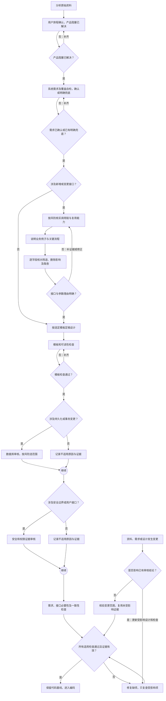

# Design Session 工作流

> 由 shared/workflow.json 生成。修正规则后重新生成，不手改流程图。

```mermaid
graph TD
  input_gate["分析原始资料"]
  clarification_gate["用户旅程确认，产品阻塞已解决"]
  clarification_gate_ok{"产品阻塞已解决？"}
  clarification_gate --> clarification_gate_ok
  clarification_gate_ok -->|否：补齐| clarification_gate
  input_gate --> clarification_gate
  spec_gate["系统需求及覆盖自检，确认或明确兜底"]
  spec_gate_ok{"需求已确认或已有明确兜底？"}
  spec_gate --> spec_gate_ok
  spec_gate_ok -->|否：补齐| spec_gate
  clarification_gate_ok -->|是| spec_gate
  design_gate_interfaces{"涉及新增或变更接口？"}
  design_gate_interfaces -->|否| design_gate
  design_gate_interfaces -->|是| design_gate_source["按风险核实调用链与复用能力"]
  design_gate_source --> design_gate_flow["说明业务例子与关键流程"]
  design_gate_flow --> design_gate_fields["逐字段核对用途、删除影响及取舍"]
  design_gate_fields --> design_gate_reason{"接口与参数理由明确？"}
  design_gate_reason -->|否：补证据或修正| design_gate_source
  design_gate_reason -->|是| design_gate
  design_gate["按选定模板定稿设计"]
  spec_gate_ok -->|是| design_gate_interfaces
  template_gate["模板和可读性检查"]
  template_gate_ok{"模板检查通过？"}
  template_gate --> template_gate_ok
  template_gate_ok -->|否：补齐| template_gate
  design_gate --> template_gate
  database_gate_applies{"涉及持久化或事务变更？"}
  database_gate["数据库审核，按风险选范围"]
  database_gate_na["记录不适用原因与证据"]
  database_gate_applies -->|是| database_gate
  database_gate_applies -->|否| database_gate_na
  database_gate --> database_gate_join(("继续"))
  database_gate_na --> database_gate_join
  template_gate_ok -->|是| database_gate_applies
  security_gate_applies{"涉及安全边界或用户接口？"}
  security_gate["安全和权限证据审核"]
  security_gate_na["记录不适用原因与证据"]
  security_gate_applies -->|是| security_gate
  security_gate_applies -->|否| security_gate_na
  security_gate --> security_gate_join(("继续"))
  security_gate_na --> security_gate_join
  database_gate_join --> security_gate_applies
  content_gate["需求、接口必要性及一致性检查"]
  security_gate_join --> content_gate
  content_gate --> ready{"所有适用检查通过且证据有效？"}
  ready -->|是| code["保留代码基线，进入编码"]
  ready -->|否| fix["修复缺项，只复查受影响项"]
  fix --> ready
  change["资料、需求或设计发生变更"] --> impact{"是否影响已有审核结论？"}
  impact -->|是：更新受影响设计和检查| fix
  impact -->|否| reuse["核验变更范围，复用未受影响证据"]
  reuse --> ready
```

已通过且输入未变化的检查直接复用；缺失、不适用、过期的判定方式见 [流程规则](workflow.md)。check database 即 database-review 的入口，不重复审核。
